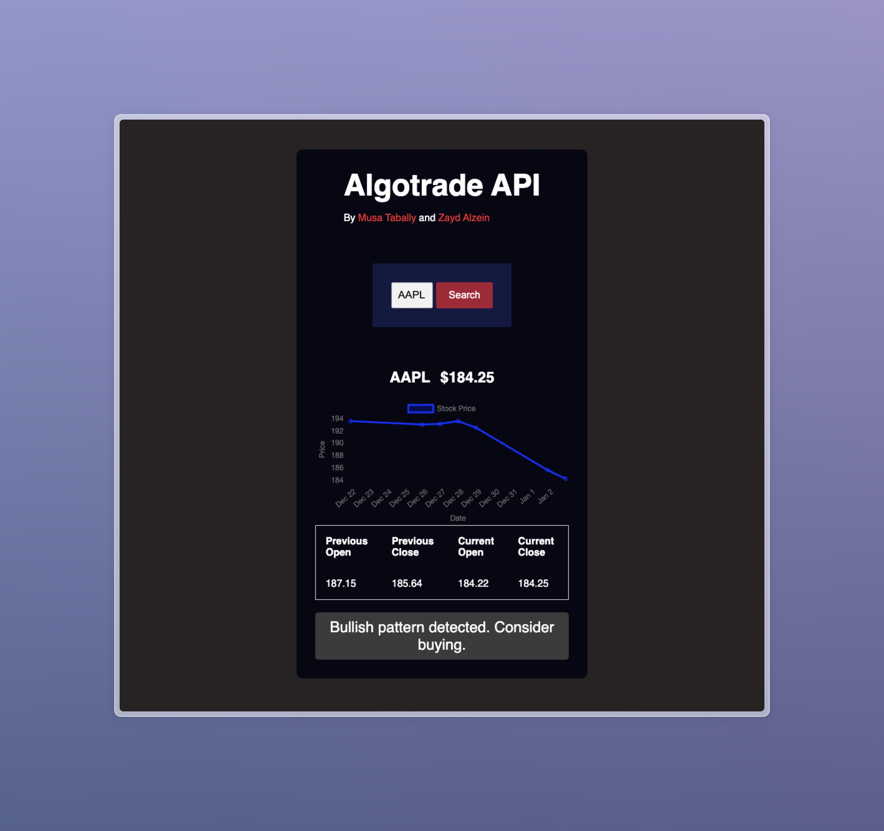

# Algotrade API

## Introduction
Algotrade API is a powerful tool designed to help traders and investors make informed decisions by providing real-time stock data analysis. By leveraging advanced algorithms, Algotrade API identifies bullish and bearish patterns, offering actionable trading signals.



## Features
- Real-time stock price tracking
- Historical data visualization with interactive charts
- Trading signal generation indicating bullish, bearish, or neutral patterns
- Easy integration with different strategies

## Quick Start
To get started with Algotrade API, follow these steps:

### Prerequisites
Ensure you have Python 3.x installed on your system. You can download it from the official Python website. Additionally, you'll need to install necessary libraries, which can be done via pip:

```
pip install -r requirements.txt
```

### Running the Application
To start the application, run the following command in your terminal:

```
python main.py
```

Open your preferred browser and navigate to `http://localhost:5000/` to access the API interface.

## Usage
Enter the stock ticker symbol in the search box and click "Search". The system will fetch the stock's current price, historical price data, and provide a trading signal.

## API Endpoints
- `/signal/<ticker>`: Fetches the signal for the given stock ticker.

## Development
### Setup Virtual Environment
It's recommended to set up a virtual environment for development:

```
python -m venv venv
source venv/bin/activate  # On Windows use `venv\Scripts\activate`
```

### Install Dependencies
Install the required dependencies with pip:

```
pip install -r requirements.txt
```

## Contributing
We welcome contributions! Please open a pull request to contribute to the project, or report any issues you encounter.

## License
Algotrade API is open-sourced software licensed under the [MIT license](LICENSE).

## Authors
- Musa Tabally - [GitHub](https://github.com/MusaTabally)
- Zayd - [GitHub](https://github.com/Zaydo123)

## Acknowledgments
A special thanks to all the contributors and users of the Algotrade API project.

